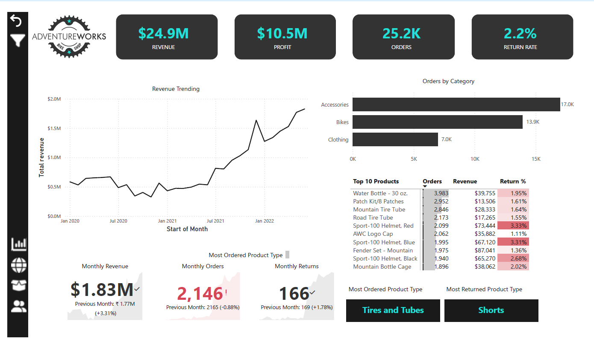
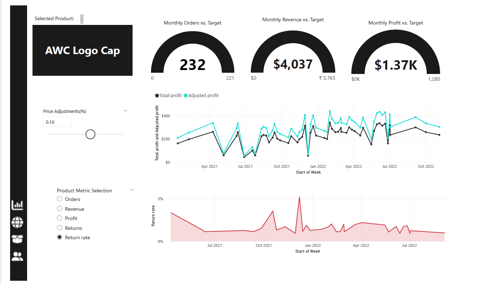
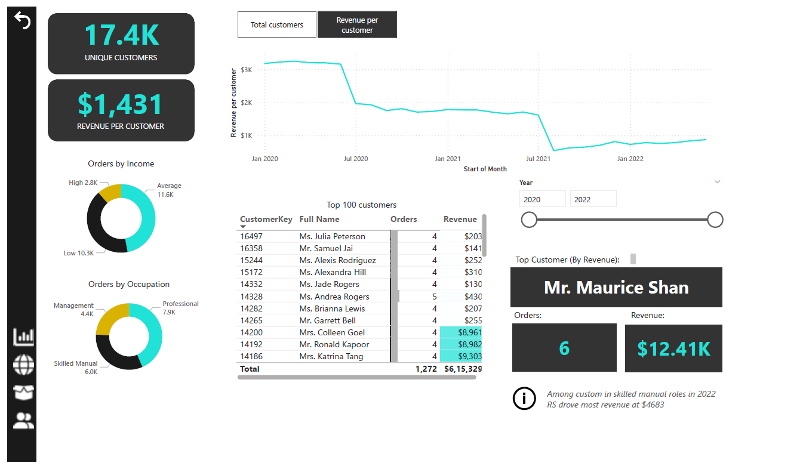
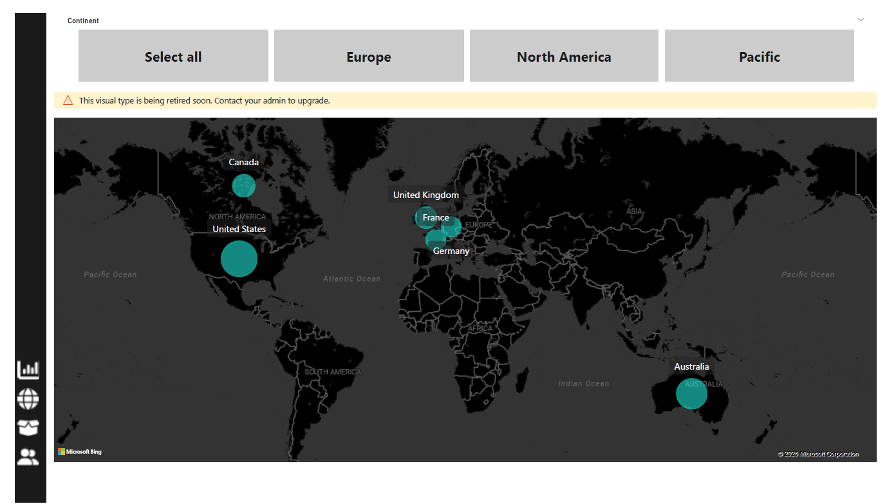

# 📊 Sales Revenue Dashboard

## 📌 Project Overview

This project is an interactive Power BI dashboard built using the AdventureWorks dataset. It provides insights into sales performance, profit trends, customer behavior, and regional performance through interactive visualizations. The dashboard is designed to help business users monitor KPIs and make data-driven decisions.
---

## 🛠️ Tools Used

- Power BI
- SQL
- DAX
- Microsoft Excel

---

## ✨ Features

- KPI Cards
- Sales Trend Analysis
- Profit Analysis
- Regional Performance Dashboard
- Interactive Filters & Slicers
- Drill-through Reports

---

## 📂 Dataset

- AdventureWorks Dataset

---

## 🖼️ Dashboard Preview

### Executive Dashboard

### Product Detail Dashboard

### Customer Detail Dashboard

### Sales Map Dashboard

## 🎯 Skills Demonstrated

- Data Cleaning
- Data Modeling
- Data Visualization
- ETL
- Dashboard Design
- Business Intelligence
- DAX Calculations
- KPI Reporting

---

## 👩‍💻 Author

**Sneha G**

LinkedIn: https://www.linkedin.com/in/sneha-g-207a232b1

